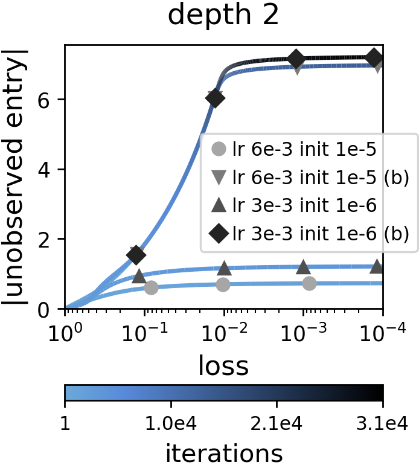
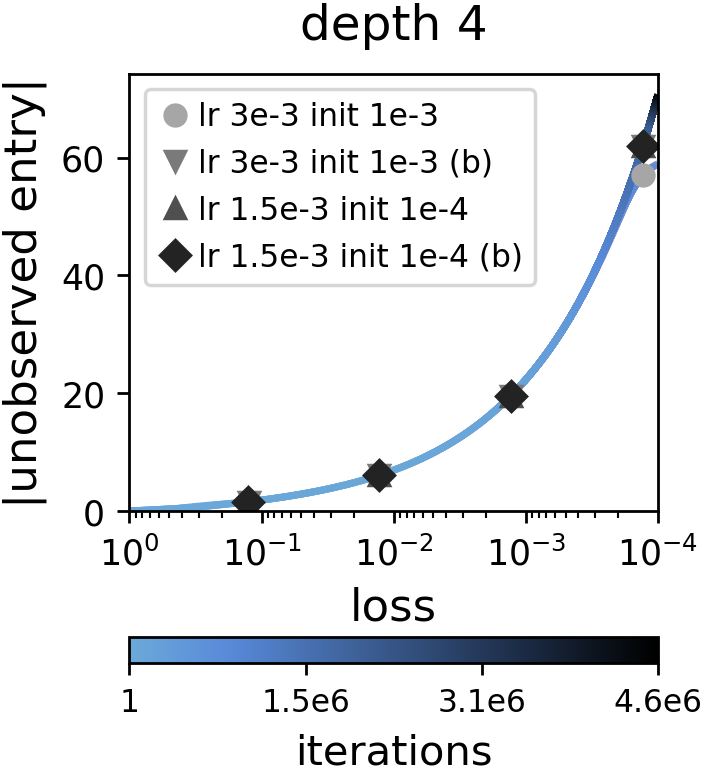

# Implicit Regularization in Deep Learning May Not Be Explainable by Norms

Code, based on the PyTorch framework, for reproducing the experiments in [Implicit Regularization in Deep Learning May Not Be Explainable by Norms](https://arxiv.org/abs/2005.06398).

## Install Requirements
Tested with python 3.7.
```
pip install -r requirements.txt
```

## 1. Deep Matrix Factorization

### 1.1 Running Experiments
The following command will run a matrix completion experiment for the setting analyzed in the paper:
```
python dmf_multiple_experiments_runner.py
```

- Experiment parameters can be customized inside the script's code. 
- Another option is to run ```dmf_experiment_runner.py``` with the desired arguments. 
- A folder with checkpoints, metric plots and a log file will be automatically created under the directory specified by the ```output_dir``` parameter (default is "outputs/dmf").

### 1.2. Plotting Results
To plot the unobserved entry (in absolute value) against the loss, use:
```
python dmf_results_plotter.py \
-experiments_checkpoint_paths <experiment_checkpoint_path1> <experiment_checkpoint_path2> ... \
-experiments_names <experiment_name1> <experiment_name2> ...
```
- The parameter ```experiments_checkpoint_paths``` accepts multiple paths. Each path points to a checkpoint file created during training, which can be found under the corresponding experiment directory in a subdirectory named "checkpoints".
- For each checkpoint path given, a matching experiment name needs to be supplied (included as the label in the plot). 
- Other options allow to add a plot title and save the figure to a file (see code, or run script with -h flag for further details).

Example plots:

<p align="center">



</p>


### 1.3. Generating New Data

Generating data for general matrix sensing/completion tasks is done using ```dmf_data_generator.py```. Afterwards, it is necessary to modify the dataset path parameter (you might want to change some of the other run parameters as well, e.g. the number of samples to use).

## 2. Tensor Completion

### 2.1. Running Experiments
The following command runs tensor completion experiments:
```
python tc_multiple_experiments_runner.py
```

- Customization of the run parameters is possible inside the script's code, with ```tc_experiment_runner.py``` allowing to pass the parameters as run arguments.
- A folder for each experiment, with checkpoints, metric plots and a log file, will be automatically created under the directory specified by the ```output_dir``` parameter (default is "outputs/tc/r1").


### 2.2. Plotting Results

To plot the reconstruction error and tensor rank against the # of observations, run the following command:
```
python tc_results_plotter.py -experiments_dir <experiment_dir>
```
- The ```experiments_dir``` parameter accepts a directory which contains multiple experiments. For example, after running ```tc_multiple_experiments_runner.py```, the relevant directory is "outputs/tc/r1". 
- Experiments are grouped according to initialization standard deviation.
- It is also possible to supply a plot title and save the figure to a file (see code, or run script with -h flag for further details).

Note that the code scans the given directories for trained models using string templates, hence, for compatibility its best to use ```tc_multiple_experiments_runner``` for running experiments.

Example plots:

<p align="center">


</p>


### 2.3. Generating New Data

To generate new tensor completion datasets, use ```tc_data_generator.py```. 


## Citation
For citing the paper, please use:
```
@article{razin2020implicit,
  title={Implicit Regularization in Deep Learning May Not Be Explainable by Norms},
  author={Razin, Noam and Cohen, Nadav},
  journal={arXiv preprint arXiv:2005.06398},
  year={2020}
}
```
